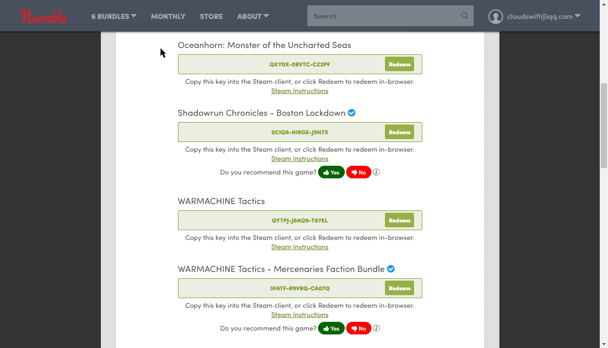
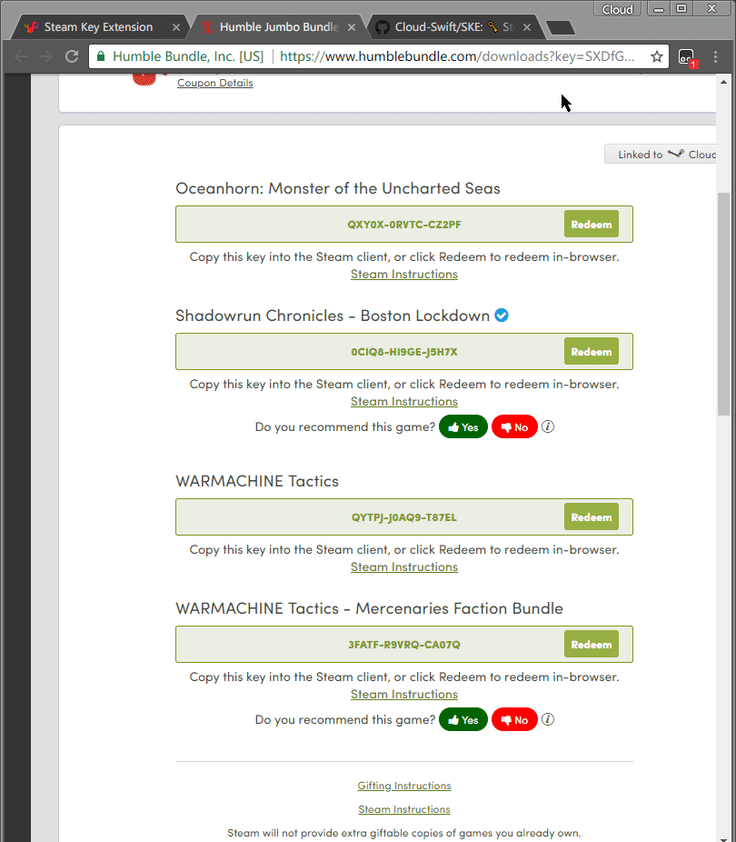
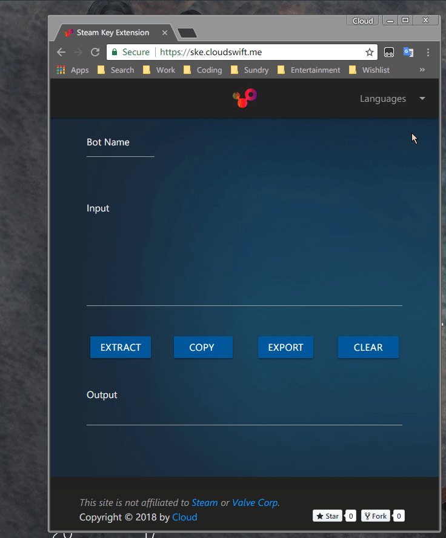
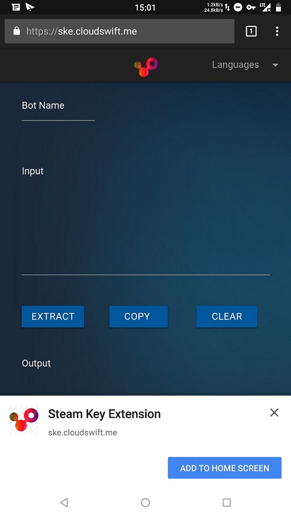

# Steam Key Extension

## Description

[Steam Key Extension](https://ske.cloudswift.me) is a web-based tool which can help you extract and format your Steam Keys to ASF `!redeem` style. Also it can export your Keys to [csv](https://en.wikipedia.org/wiki/Comma-separated_values) file with game titles.

## Core Features

- Extract your keys from a large number of text.
- Format keys into [ASF](https://github.com/JustArchi/ArchiSteamFarm) `!redeem` style.
- Export Keys to csv file with game titles.
- Full [PWA](https://developers.google.com/web/progressive-web-apps/) (Progressive Web Apps).
- Can use offline.
- No web server,full static site (Thanks to [GitHub Page](https://pages.github.com/)).
- Can use it on mobile devices like native apps.

## How to use

- Just open [https://ske.cloudswift.me](https://ske.cloudswift.me) in your loved browser.
- Input your Bot Name.(optional)
- Copy your text to "Input" textarea
- Clicking "Extract" button will extract your keys to "Output" textarea into ASF `!redeem` format.
- Clicking "Copy" button will copy the text in "Output" textarea.
- Clicking "Clear" button will clear "Input" and "Output".
- Clicking "Export" button will export Keys with titles to a csv file. (Note: At present, only support Humble Bundle, Fanatical, Indiegala, Groupees, DailyIndieGame and some of Agiso)

### Extract Keys Demo

### Export Keys with Titles Demo

## Use it offline

These feature need broswer support.(Chrome version 64+,latest Firefox/Opera/Safari/Microsoft Edge)

1. Open [chrome://flags](chrome://flags/#enable-desktop-pwas), Enable "Desktop PWAs".(Note: Chrome will restart.)
2. Open [SKE](https://ske.cloudswift.me), then click "Customize and control Google Chrome" and select "Install to desktop..."
3. Well done! Now, you can use it offline.
4. You can open it via [Chrome Apps](chrome://apps) or Windows Start Menu.

### Install to Desktop by Chrome Demo

### Install to Android by Chrome Demo

Add it, then you can find it in launcher and use it like native apps.

## Unstall

Open [Chrome Apps](chrome://apps) -> right-click the icon -> Remove from Chrome.

## To be continue

If you have any problems in use, feel free issue an issue.