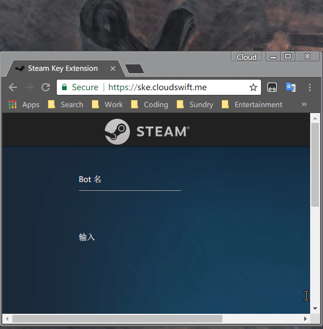

# Steam Key Extension

## Description

[Steam Key Extension](https://ske.cloudswift.me) is a web-based tool which can help you extract and format your Steam Keys to ASF style.

## Core Features

- Extract your keys from a large number of text.
- Format keys with [ASF](https://github.com/JustArchi/ArchiSteamFarm) style.

## How to use

- Just open https://ske.cloudswift.me in your loved browser.
- Input your Bot Name.(optional)
- Copy your text to "Input" textarea
- Clicking "Extract" button will extract your keys to "Output" textarea with ASF format.
- Clicking "Copy" button will copy the text in "Output" textarea.
- Clicking "Clear" button will clear "Input" and "Output".

### Demo

## Use it offline (Chrome Version 64+ only)

If you love this tool, you can save if to your Chrome, so that you could use it offline.

1. Open [chrome://flags](chrome://flags), then find "Desktop PWAs" and Enable it.(Note: Chrome will restart.)
2. Open [SKE](https://ske.cloudswift.me), then click "Customize and control Google Chrome" and select "Add to desktop..."
3. Well done! Now, you can use it offline.

Hint: If you don't like icon on your Desktop. Delete it, and find the entry in "[Apps](chrome://apps)" (left of bookmarks bar).

### Demo

## To be continue

More features are comming.😁

See to-do list [here](https://github.com/Cloud-Swift/SKE/issues/1).