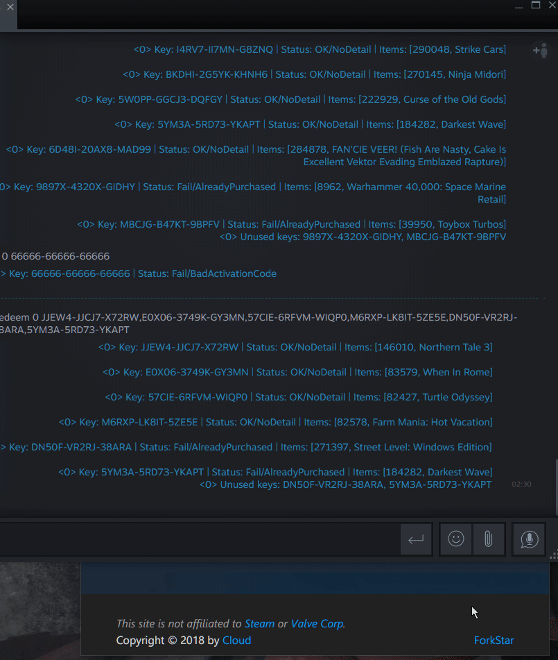

# Steam Key Extension

## Description

[Steam Key Extension](https://ske.uma.im) is a web-based tool which can help you extract and format your Steam Keys to the `!redeem` command of [ArchiSteamFarm](https://github.com/JustArchiNET/ArchiSteamFarm). Also, it can export your keys to a [csv](https://en.wikipedia.org/wiki/Comma-separated_values) file with game titles.

## Core Features

- Extract your keys from a large amount of text.
- Format keys into the `!redeem` command of [ArchiSteamFarm](https://github.com/JustArchiNET/ArchiSteamFarm).
- Export Keys to a csv file with game titles.
- Full [PWA](https://developers.google.com/web/progressive-web-apps/) (Progressive Web Apps).
- Can use offline.
- No third-party web server, full static site hosted on [GitHub Page](https://pages.github.com/).
- Can use it on smart phone like native apps.

## How to use

- Just open [the site](https://ske.uma.im/).
- Input your Bot Name. *optional*
- Copy your text to "Input" text area.
- Clicking "Extract" will extract your keys to the "Output" text area as a `!redeem` command.
- Clicking "Copy" will copy the text in "Output" text area.
- Clicking "Clear" will clear the "Input" and "Output" text areas.
- Clicking "Export" will export Keys with titles to a csv file. *Note: At present, only support Humble Bundle, Fanatical, Indiegala, Groupees, DailyIndieGame and some of Agiso*

### Extract Keys Demo

### Export Keys with Titles Demo

### Export Keys from ASF output

Only export AlreadyPurchased Keys

## Using it offline

These feature need broswer support. *Chrome version 64+,latest Firefox/Opera/Safari/Microsoft Edge*

1. Open Chrome Flags (chrome://flags/#enable-desktop-pwas), Enable "Desktop PWAs". *Note: Chrome will restart.*
2. Open [SKE](https://ske.uma.im/), then click "Customize and control Google Chrome" and select "Install to desktop..."
3. Well done! Now, you can use it offline.
4. You can open it via Chrome Apps (chrome://apps) or Windows Start Menu.

### Install to Desktop by Chrome Demo

### Install to Android by Chrome Demo

Add it, then you can find it in launcher and use it like native apps.

## Unstall

Open Chrome Apps(chrome://apps) -> right-click the icon -> Remove from Chrome.

## Privacy Policy

This is a full static site, and there is no third-party server. Nobody can get your infomation or the text you type.

This site is open source based on the MIT License, and anyone can view the source code of this site here.

## Feedback

If you have any problems in use, feel free to leave a message in [issue page](https://github.com/umaim/SKE/issues).
